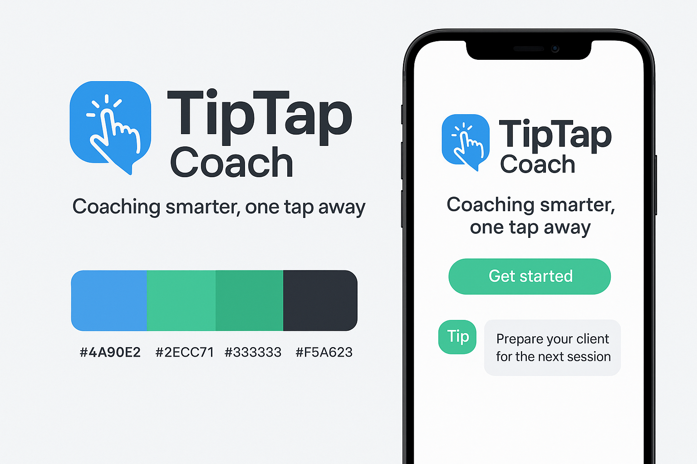

# Idea de marca

Si quieres usar palabras como **“tip”**, **“tap”** y **“coach”** para **nombrar o definir un ayudante de coaching** (por ejemplo, una app, asistente virtual o herramienta de apoyo para coaches o coachees), puedes aprovechar el juego de palabras en inglés para transmitir **agilidad, interacción y guía**.

Aquí te explico cómo podrías interpretarlas y combinarlas:

---

### 💬 Significado base de cada palabra:

* **Tip** → consejo breve, truco, recomendación.
* **Tap** → tocar (acción rápida, interactiva, como en una app).
* **Coach** → entrenador, guía, mentor.

---

### 🧠 Ideas de combinación y significado:

| Nombre / combinación | Traducción o sentido aproximado                                         | Concepto que transmite                                                             |
| -------------------- | ----------------------------------------------------------------------- | ---------------------------------------------------------------------------------- |
| **TipTap Coach**     | “Coach interactivo de consejos” / “Entrenador que da tips con un toque” | Un asistente que da consejos breves e interactivos (como al tocar en la pantalla). |
| **TapCoach**         | “Coach táctil” o “Entrenador digital”                                   | Un ayudante accesible con solo tocar (ideal para app o IA).                        |
| **TipCoach**         | “Coach de consejos”                                                     | Un asistente que ofrece tips personalizados para mejorar.                          |
| **Tap & Tip Coach**  | “Entrenador de toques y consejos”                                       | Enfatiza la combinación de interacción y sabiduría práctica.                       |

---

### 💡 Si buscas una **traducción o descripción en español**, podrías decir:

* **“Asistente interactivo de coaching”**
* **“Ayudante virtual de coaching”**
* **“Coach digital que da consejos prácticos”**
* **“Asistente de consejos para el desarrollo personal”**

---

¡Sí! 😄 “**TipTap Coach**” funciona muy bien como nombre para una app diseñada para **ayudar a un coach en sus sesiones**, y tiene varias capas de significado que encajan con eso:

---

### 🔹 Significado implícito de “TipTap Coach”:

1. **Tip** → consejos, ideas prácticas, recordatorios.

   * La app puede dar sugerencias al coach sobre cómo guiar la sesión, qué preguntas hacer, qué ejercicios proponer, etc.

2. **Tap** → interacción rápida, digital, táctil.

   * Evoca la acción de tocar la pantalla para acceder a información al instante o registrar datos de la sesión.

3. **Coach** → refuerza que es un asistente **para profesionales del coaching**.

---

### 🔹 Lo que transmite como nombre de app:

* Dinamismo y modernidad → “Tap” sugiere rapidez y tecnología.
* Utilidad práctica → “Tip” sugiere que ofrece consejos útiles en el momento.
* Funcionalidad → El coach es el usuario principal, y la app lo **asiste discretamente durante las sesiones**.

---

### 🔹 Traducción o descripción en español:

* **“TipTap Coach: asistente digital para coaches”**
* **“TipTap Coach: tu ayudante de sesiones de coaching”**
* **“TipTap Coach: consejos rápidos y apoyo interactivo para coaches”**

---

Perfecto 😄 Aquí tienes varias ideas de **eslogan cortos y pegajosos** para “TipTap Coach”, pensados para transmitir que es un **asistente digital para coaches**:

---

### 🔹 Opciones en inglés:

1. **“Tips at your fingertips”** → “Consejos al alcance de tu mano”
2. **“Coach smarter, tap faster”** → “Entrena mejor, toca más rápido”
3. **“Your coaching assistant, one tap away”** → “Tu asistente de coaching, a un toque de distancia”
4. **“Quick tips, smoother sessions”** → “Consejos rápidos, sesiones más fluidas”

---

### 🔹 Opciones en español:

1. **“Consejos rápidos, sesiones efectivas”**
2. **“Tu asistente de coaching al instante”**
3. **“Tips al toque, coaching sin esfuerzo”**
4. **“Apoyo práctico para tus sesiones”**

---

¡Genial! 😄 Aquí tienes una lista de **15 eslóganes creativos para “TipTap Coach”**, mezclando opciones en inglés, español y algunas bilingües, pensados para transmitir claramente que es un **asistente digital para coaches**:

---

### 🔹 Opciones en inglés:

1. **“Tips at your fingertips”** – Consejos al alcance de tu mano
2. **“Coach smarter, tap faster”** – Entrena mejor, toca más rápido
3. **“Your coaching assistant, one tap away”** – Tu asistente de coaching, a un toque de distancia
4. **“Quick tips, smoother sessions”** – Consejos rápidos, sesiones más fluidas
5. **“Guidance in every tap”** – Orientación en cada toque

---

### 🔹 Opciones en español:

6. **“Consejos rápidos, sesiones efectivas”**
7. **“Tu asistente de coaching al instante”**
8. **“Tips al toque, coaching sin esfuerzo”**
9. **“Apoyo práctico para tus sesiones”**
10. **“Mejora tus sesiones, un toque a la vez”**

---

### 🔹 Opciones bilingües / creativas:

11. **“Tap, tip, coach: mejora al instante”**
12. **“One tap, endless tips”** – Un toque, infinitos consejos
13. **“Tus tips, al toque”**
14. **“Coaching smarter, consejos más rápidos”**
15. **“TipTap Coach: tu guía digital en cada sesión”**

---

¡Perfecto! 😎 Vamos a darle un **toque profesional y moderno** a “TipTap Coach”, pensado como **marca de app/tech para coaches**, con nombres y eslóganes cortos, memorables y con estilo tecnológico. Aquí tienes varias opciones:

---

### 🔹 **Nombres + eslogan cortos estilo tech / branding**

1. **TipTap Coach** – *“Coaching smarter, one tap away”*
2. **TipTap** – *“Consejos rápidos, sesiones efectivas”*
3. **TapCoach** – *“Tu asistente digital en cada sesión”*
4. **TipTap Pro** – *“Eleva tu coaching al instante”*
5. **TipTap Hub** – *“Todo tu coaching al toque”*
6. **CoachTap** – *“Tu guía en cada tap”*
7. **TipTap AI** – *“Inteligencia para coaches, un toque a la vez”*
8. **TipTap Flow** – *“Sesiones fluidas con tips al instante”*
9. **Tap&Tip** – *“Coaching más rápido, consejos más claros”*
10. **TipTap GO** – *“Lleva tu coaching a donde quieras”*

---

### 🔹 **Concepto de marca / estilo**

* **Corto y memorable**: TipTap Coach se queda en la mente fácil de recordar.
* **Interactivo y moderno**: “Tap” evoca tecnología táctil y rapidez.
* **Práctico y útil**: “Tip” indica consejos claros y aplicables.
* **Flexible**: Perfecto tanto para app móvil, web, como asistente virtual o IA.

---

¡Perfecto! 😄 Vamos a crear un **concepto completo de branding para “TipTap Coach”**, listo para presentar como app profesional. Incluiré **logotipo conceptual, paleta de colores, tipografía y estilo general**.

---

## **1. Nombre de la marca**

**TipTap Coach**

* Corto, pegajoso y fácil de recordar.
* Combina “Tip” (consejo) y “Tap” (interacción digital) con “Coach” (usuario objetivo).

---

## **2. Eslogan sugerido**

**“Coaching smarter, one tap away”**

* Refuerza la idea de que la app ayuda al coach de manera rápida, práctica e interactiva.
* Alternativas:

  * *“Consejos rápidos, sesiones efectivas”*
  * *“Tu asistente digital en cada sesión”*

---

## **3. Logotipo conceptual**

* **Icono:**

  * Un **dedo tocando una pantalla** con un **destello de luz** o un **check** que simboliza consejo/apoyo.
  * Una **burbuja de tips** (como chat) integrada con un pequeño icono de “play” o “tap”.
* **Tipografía:**

  * Moderna, sans-serif, estilo **tech / friendly**.
  * Ejemplos: **Poppins, Nunito, Montserrat, Inter**.
* **Estilo:**

  * Minimalista, limpio, con iconografía reconocible en app y web.

---

## **4. Paleta de colores sugerida**

* **Primario:** Azul eléctrico (#4A90E2) → confianza, tecnología, profesional.
* **Secundario:** Verde menta (#2ECC71) → crecimiento, ayuda, progreso.
* **Complementario:** Gris oscuro (#333333) → texto, neutralidad.
* **Accent:** Amarillo brillante (#F5A623) → acción, tips destacados, alertas.

---

## **5. Uso visual y estilo general**

* **App:** Iconos simples, botones grandes y “tappable”, colores vivos para tips y acciones importantes.
* **Web / Marketing:** Banner con dedo tocando pantalla, tips emergentes, diseño limpio y profesional.
* **Impresión / Papelería:** Logo con solo icono o con nombre completo, estilo moderno y minimal.

---

¡Perfecto! 😄 Vamos a crear un **concepto completo de branding para “TipTap Coach”**, listo para presentar como app profesional. Incluiré **logotipo conceptual, paleta de colores, tipografía y estilo general**.

---

## **1. Nombre de la marca**

**TipTap Coach**

* Corto, pegajoso y fácil de recordar.
* Combina “Tip” (consejo) y “Tap” (interacción digital) con “Coach” (usuario objetivo).

---

## **2. Eslogan sugerido**

**“Coaching smarter, one tap away”**

* Refuerza la idea de que la app ayuda al coach de manera rápida, práctica e interactiva.
* Alternativas:

  * *“Consejos rápidos, sesiones efectivas”*
  * *“Tu asistente digital en cada sesión”*

---

## **3. Logotipo conceptual**

* **Icono:**

  * Un **dedo tocando una pantalla** con un **destello de luz** o un **check** que simboliza consejo/apoyo.
  * Una **burbuja de tips** (como chat) integrada con un pequeño icono de “play” o “tap”.
* **Tipografía:**

  * Moderna, sans-serif, estilo **tech / friendly**.
  * Ejemplos: **Poppins, Nunito, Montserrat, Inter**.
* **Estilo:**

  * Minimalista, limpio, con iconografía reconocible en app y web.

---

## **4. Paleta de colores sugerida**

* **Primario:** Azul eléctrico (#4A90E2) → confianza, tecnología, profesional.
* **Secundario:** Verde menta (#2ECC71) → crecimiento, ayuda, progreso.
* **Complementario:** Gris oscuro (#333333) → texto, neutralidad.
* **Accent:** Amarillo brillante (#F5A623) → acción, tips destacados, alertas.

---

## **5. Uso visual y estilo general**

* **App:** Iconos simples, botones grandes y “tappable”, colores vivos para tips y acciones importantes.
* **Web / Marketing:** Banner con dedo tocando pantalla, tips emergentes, diseño limpio y profesional.
* **Impresión / Papelería:** Logo con solo icono o con nombre completo, estilo moderno y minimal.

---

